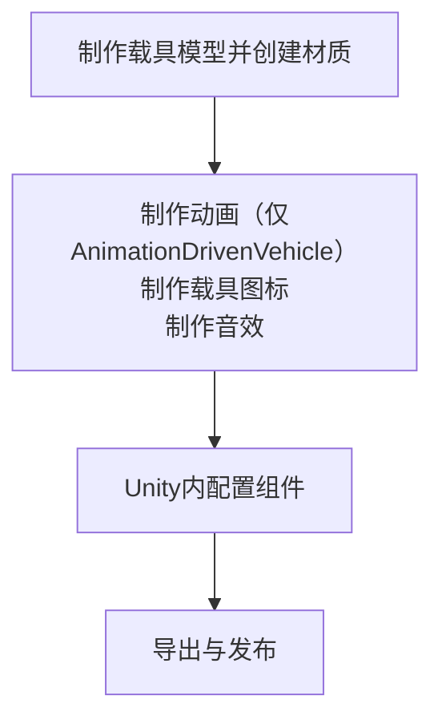

# vhc.1 载具

## 前言

在此文档中，我们将为您呈现制作一个载具的大致过程

:::info
**同样地，在本文档中，我们不会指导您制作套皮载具**
:::

## 0.0 构思
同样地，像[wpn.1](/cn/Tutorials/wpn.1.md)一样

你要做的东西对应你所需要使用的Unity组件：
| 载具类型 | 对应组件 |
|------|------|
| 飞机 | [Airplane](/cn/Components/Airplane.md) |
| 简单载具、固定载具 | [Vehicle](/cn/Components/Vehicle.md) |
| 直升机 | [Helicopter](/cn/Components/Helicopter.md) |
| 船只 | [Boat](/cn/Components/Boat.md) |
| 碰碰车、车辆（带物理效果） | [ArcadeCar](/cn/Components/ArcadeCar.md) |
| [MG Rex](https://metalgear.fandom.com/wiki/Metal_Gear_REX)（自定义动画） | [AnimationDrivenVehicle](/cn/Components/AnimationDrivenVehicle.md) |

上述的每一种载具都需要以下流程：

是的，又要出发了！

## 1.0 确定所需资源

类似的，一个载具同样包含模型、音效、以及[粒子效果](https://docs.unity.cn/cn/2020.3/Manual/ParticleSystems.html)

上述三项资源需要您自行上网寻找或按要仿制的游戏武器自行寻找对应原版游戏美术资源、或自制

## 1.1 调整模型

模型这步真的没什么好说的，因载具而异

如果只是想练手，可以直接使用RFTools\Models\Vehicles内的模型

如果想自己制作而建模有些许不行，可以自行寻找模型或按要仿制的游戏武器自行寻找对应原版游戏美术资源

值得注意的是模型的几个问题：

确保模型的面数始终保持在一个相对较低的范围如8万,减少在Blender里三角面与四角面的混用,以防在规格化转换与材质映射中出现问题

确保模型的原点、法向正确

分好可动件与子级

总而言之、确保模型的规格化

::: details 如果是AnimationDrivenVehicle...（制作动画）
未实装、请先参考[Unity文档](https://docs.unity.cn/cn/2020.3/Manual/AnimationSection.html)
:::

## 2.0 导入Unity

导出的过程敬请参考首页的[提示](/cn/Tutorials/#模型、动画制作)

打开Unity项目

如果您未创建Unity项目或导入RFTools.unitypackage，请自行导入，此处不再赘述

然后新建一个场景，乌鸦官方没有提供一个类似Weapon Lab.unity的场景用于测试载具

我们将在这个场景继续我们的全部工作

## 2.1 在Unity配置

一个载具包含什么？

包含载具主体[Vehicle]((/cn/Components/Vehicle.md))（或其派生组件）座位[Seat]((/cn/Components/Seat.md))、座位上的武器、座位武器的HUB（如果有）

## 3.0 测试与导出
