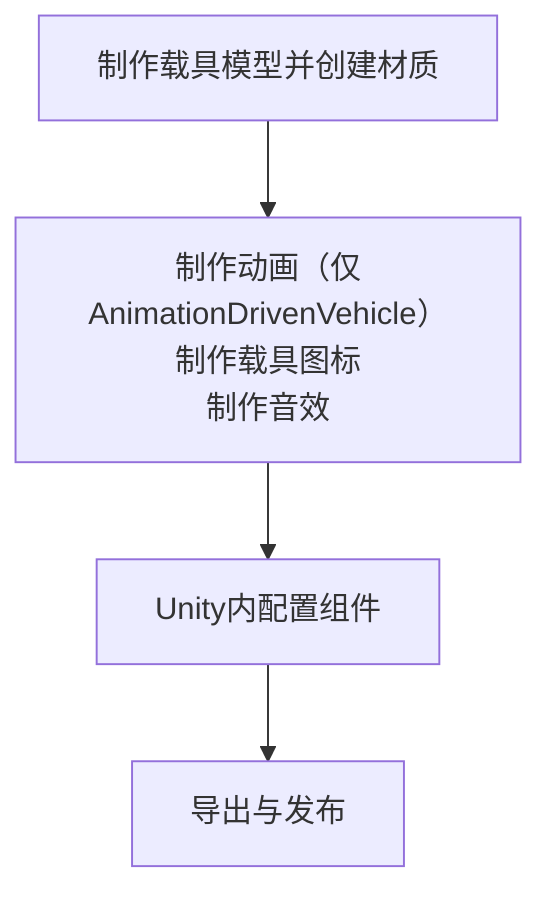

# vhc.1 载具

## 前言

在此文档中，我们将为您呈现制作一个载具的大致过程并详细解释每一步制作过程

:::info
**同样地，在本文档中，我们不会指导您制作套皮载具**
:::

## 0.0 构思
同样地，像[wpn.1](/cn/Tutorials/wpn.1.md)一样

你要做的东西对应你所需要使用的Unity组件：
| 载具类型 | 对应组件 |
|------|------|
| 飞机 | [Airplane](/cn/Components/Airplane.md) |
| 简单载具 | [Vehicle](/cn/Components/Vehicle.md) |
| 直升机 | [Helicopter](/cn/Components/Helicopter.md) |
| 船只 | [Boat](/cn/Components/Boat.md) |
| 碰碰车（带物理效果） | [ArcadeCar](/cn/Components/ArcadeCar.md) |
| [MG Rex](https://metalgear.fandom.com/wiki/Metal_Gear_REX)（自定义动画） | [AnimationDrivenVehicle](/cn/Components/AnimationDrivenVehicle.md) |

上述的每一种载具都需要以下流程：

是的，又要出发了！

## 1.0 确定所需资源

类似的，一个载具同样包含模型、音效、以及[粒子效果](https://docs.unity.cn/cn/2020.3/Manual/ParticleSystems.html)

上述三项资源需要您自行上网寻找或按要仿制的游戏武器自行寻找对应原版游戏美术资源、或自制

## 1.1 调整模型

## 2.0 导入Unity

## 3.0 测试与导出
