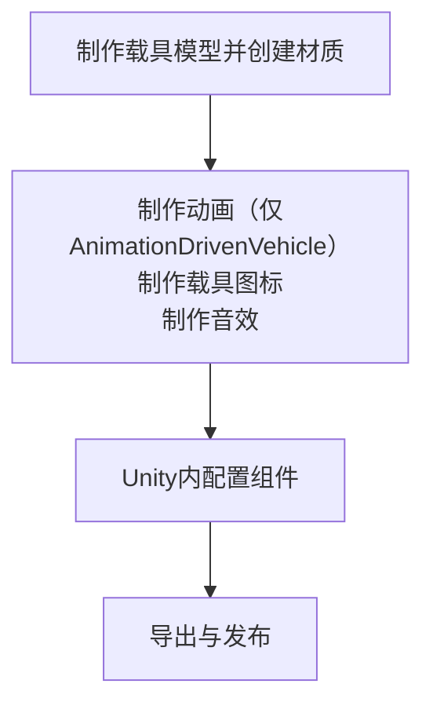

# 教程 vhc.1 载具

## 前言

在此文档中，我们将为您呈现制作一个载具的大致过程，使用原版载具作为示例

:::info
**同样地，在本文档中，我们不会指导您制作套皮载具（隐藏原模型Render的事）**
:::

## 0.0 构思
同样地，像[wpn.1](/cn/Tutorials/wpn.1.md)一样

你要做的东西对应你所需要使用的Unity组件：
| 载具类型 | 对应组件 |
|------|------|
| 飞机 | [Airplane](/cn/Components/Airplane.md) |
| 简单载具、固定载具 | [Vehicle](/cn/Components/Vehicle.md) |
| 直升机 | [Helicopter](/cn/Components/Helicopter.md) |
| 船只 | [Boat](/cn/Components/Boat.md) |
| 碰碰车、车辆（带物理效果） | [ArcadeCar](/cn/Components/ArcadeCar.md) |
| [MG Rex](https://metalgear.fandom.com/wiki/Metal_Gear_REX)（自定义动画） | [AnimationDrivenVehicle](/cn/Components/AnimationDrivenVehicle.md) |

上述的每一种载具都需要以下流程：


是的，又要出发了！

## 1.0 确定所需资源

类似的，一个载具同样包含模型、音效、以及[粒子效果](https://docs.unity.cn/cn/2020.3/Manual/ParticleSystems.html)

上述三项资源需要您自行上网寻找或按要仿制的游戏武器自行寻找对应原版游戏美术资源、或自制

## 1.1 调整模型

模型这步真的没什么好说的，因载具而异

如果只是想练手，可以直接使用`RFTools\Models\Vehicles`内的模型

如果想自己制作而建模有些许不行，可以自行寻找模型或按要仿制的游戏武器自行寻找对应原版游戏美术资源

值得注意的是模型的几个问题：

确保模型的面数始终保持在一个相对较低的范围如8万,减少在Blender里三角面与四角面的混用,以防在规格化转换与材质映射中出现问题

确保模型的原点、法向正确

分好可动件与子级

总而言之、确保模型的规格化

::: details 如果是AnimationDrivenVehicle...（制作动画）
未实装、请先参考[Unity文档](https://docs.unity.cn/cn/2020.3/Manual/AnimationSection.html)与社区[Steam指南](https://steamcommunity.com/sharedfiles/filedetails/?id=3000223001)

已经够用
:::

## 2.0 导入Unity

导出的过程敬请参考教程首页的[提示](/cn/Tutorials/#模型、动画制作)

打开Unity项目

如果您未创建Unity项目或导入`RFTools.unitypackage`，请自行导入，此处不再赘述

然后新建一个场景，乌鸦官方没有提供一个类似`Weapon Lab.unity`的场景用于测试载具

我们将在这个场景继续我们的全部工作

将载具模型添加入场景

## 2.1 各个载具组成

一个载具包含什么？


以下为各个类型载具的组成（面向差异、原版载具向与一些比较隐蔽的步骤）

### 2.1.1 Jeep与武装Jeep

原版中Jeep使用的是[ArcadeCar](/cn/Components/ArcadeCar.md),你也可以直接使用[Vehicle](/cn/Components/Vehicle.md),但可能会缺失一些物理效果

在这个模型中，模型包含车体、座位、方向盘、车轮，要进行的操作包括：
```md
- 添加载具组件、Rigidbody与AudioSource组件
- 配置方向盘动画、粒子效果、音效、车轮、座位及相机
- 配置载具组件
```

在载具模型顶层添加[ArcadeCar](/cn/Components/ArcadeCar.md)与Rigidbody与AudioSource组件

找到方向盘物体，可以直接挂上SteeringWheel组件并配置，确保方向盘模型的z轴在LOCAL坐标模式下转地正常（否则你得套一个空物体在模型上，作为子物体）：

{缺图}

再然后在方向盘下放两个子物体作为手放在方向盘的位置，待会备用


## 3.0 测试与导出
