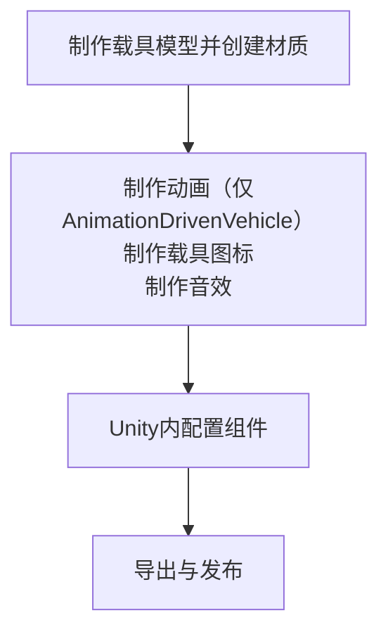

# 教程 vhc.1 载具

## 前言

在此文档中，我们将为您呈现制作一个载具的大致过程，使用原版载具作为示例

## 0.0 构思
同样地，像[wpn.1](/cn/Tutorials/wpn.1.md)一样

你要做的东西对应你所需要使用的Unity组件：
| 载具类型 | 对应组件 |
|------|------|
| 飞机 | [Airplane](/cn/Components/Airplane.md) |
| 简单载具、固定载具 | [Vehicle](/cn/Components/Vehicle.md) |
| 直升机 | [Helicopter](/cn/Components/Helicopter.md) |
| 船只 | [Boat](/cn/Components/Boat.md) |
| 碰碰车、车辆（带物理效果） | [ArcadeCar](/cn/Components/ArcadeCar.md) |
| [MG Rex](https://metalgear.fandom.com/wiki/Metal_Gear_REX)（自定义动画） | [AnimationDrivenVehicle](/cn/Components/AnimationDrivenVehicle.md) |

上述的每一种载具都需要以下流程：


是的，又要出发了！

## 1.0 确定所需资源

类似的，一个载具同样包含模型、音效、以及[粒子效果](https://docs.unity.cn/cn/2020.3/Manual/ParticleSystems.html)

上述三项资源需要您自行上网寻找或按要仿制的游戏武器自行寻找对应原版游戏美术资源、或自制

## 1.1 调整模型

模型这步真的没什么好说的，因载具而异

如果只是想练手，可以直接使用`RFTools\Models\Vehicles`内的模型

如果想自己制作而建模有些许不行，可以自行寻找模型或按要仿制的游戏武器自行寻找对应原版游戏美术资源

值得注意的是模型的几个问题：

确保模型的面数始终保持在一个相对较低的范围如8万,减少在Blender里三角面与四角面的混用,以防在规格化转换与材质映射中出现问题

确保模型的原点、法向正确

分好可动件与子级

总而言之、确保模型的规格化

::: details 如果是AnimationDrivenVehicle...（制作动画）
未实装、请先参考[Unity文档](https://docs.unity.cn/cn/2020.3/Manual/AnimationSection.html)与社区[Steam指南](https://steamcommunity.com/sharedfiles/filedetails/?id=3000223001)

已经够用
:::

## 2.0 导入Unity

导出的过程敬请参考教程首页的[提示](/cn/Tutorials/#模型、动画制作)

打开Unity项目

如果您未创建Unity项目或导入`RFTools.unitypackage`，请自行导入，此处不再赘述

然后新建一个场景，乌鸦官方没有提供一个类似`Weapon Lab.unity`的场景用于测试载具

我们将在这个场景继续我们的全部工作

将载具模型添加入场景

## 2.1 各个载具组成（简单换皮向）

出于快速入门与简单易行的原因，我们将向你介绍一种简单易行的方法来快速制作载具

首先按照要制作的载具类型，复制粘贴一个原版对应载具的Prefab，这就是我们的工作prefab

各个原版载具包含什么？

## 2.2 各个载具组成（复杂向）

以下为各个类型原版载具的组成（面向差异，与一些比较隐蔽的步骤）

下面的一些配置项跟着的值为原版各载具的值

### 2.1.1 Jeep与武装Jeep

原版中Jeep使用的是[ArcadeCar](/cn/Components/ArcadeCar.md),你也可以直接使用[Vehicle](/cn/Components/Vehicle.md),但可能会缺失一些物理效果

在这个模型中，模型包含车体、座位、方向盘、车轮，要进行的操作包括：
```md
- 添加载具组件、Rigidbody与AudioSource组件
- 配置，添加BoxCollider、方向盘动画、粒子效果、音效、车轮、座位及相机
- 配置载具组件
```

新建一个空物体（这将作为载具物体。不推荐直接将模型拖入场景，模型物体作为载具物体，模型的中心点可能不正确），将模型（`RFTools/Models/Vehicles/jeep.blend`）拖入空物体内，作为其子物体添加进去

在载具物体顶层添加[ArcadeCar](/cn/Components/ArcadeCar.md)组件

在载具物体顶层添加Rigidbody组件配置其`mass`=300、`drag`=0.1、`angularDrag`=3，参考[刚体](https://docs.unity.cn/cn/2020.3/Manual/class-Rigidbody.html)

在载具物体内均匀添加BoxCollider，使其基本覆盖载具，可以留一些空

与AudioSource，勾选`loop`，参下）组件


找到方向盘物体，可以直接挂上SteeringWheel组件并配置，确保方向盘模型的z轴在LOCAL坐标模式下转地正常（否则你得套一个空物体在模型上，作为子物体）：

{缺图}

再然后在方向盘下放两个子物体作为手放在方向盘的位置，待会备用：

{缺图}

新建两个Particle System粒子系统子物体（或从原版jeep处复制粘贴，推荐），作为载具的`smokeParticles`和`deathParticles`

仿照原版jeep，配置这两个粒子系统的Main（原版中改变了`duration`、`looping`、`startLifetime`、`startSpeed`、`startSize`、`startRotation`、`startColor`、`scalingMode`、`playOnAwake`,注意配置项旁边的小三角）、Emission（原版中改变了`rateOverTime`、`bursts`）、Renderer模块（原版中改变了`material`、`sortingFudge`、`reflectionProbes`），参见[粒子系统](https://docs.unity.cn/cn/2020.3/Manual/PartSysMainModule.html)

然后将其放入载具组件对应位置`smokeParticles`和`deathParticles`

新建两个空物体，并分别挂载AudioSource组件（如果你刚才是复制粘贴原版jeep粒子系统的话，那么应该已经带了AudioSource组件，可以免去这步），作为载具的`impactAudio`和`deathSound`

配置这两个AudioSource组件（原版中改变了`audioClip`、`playOnAwake`、`priority`、`volumeRolloff`、`maxDistance`、立体音3D曲线）参见[AudioSource组件](https://docs.unity.cn/cn/2020.3/Manual/class-AudioSource.html)

然后将其放入载具组件对应位置

新建一个空物体，添加CarWheel组件（如果CarWheel组件的绿色圆圈旋转不正确，你需要先旋转一下这个空物体，使它回到正确位置）：


将一个车轮模型作为子物体放进去，调整好位置，使其与圆圈重合：

然后删掉其他的轮子模型物体，复制粘贴做好的这个放到原位置上（你也可以分别弄，但会麻烦得多）。这个不用像刚才一样将其放入载具组件对应位置（因为不需要放）：

新建一个相机子物体，放在载具内合适位置，禁用其上的Camera组件，添加ThirdPersonCameraLook组件。作为第三人称视角相机，备用

新建一个空物体并添加Seat、BoxCollider组件（你也可以直接在模型物体上添加组件，但不推荐，除非模型的缩放为0），然后调整BoxCollider大小，将一个座椅模型作为子物体放进去并调整好位置使其重合与BoxCollider重合

然后删掉其他的座椅模型物体，复制粘贴做好的这个放到原位置上（如果你是直接在模型物体上添加组件，复制粘贴组件即可。你也可以分别弄，但会麻烦得多）。这个它们放入载具组件对应位置`seats`

配置各个Seat的`allowLean`、`exitOffset`、`ThirdPersonCamera`，放入刚才新建的相机

对于驾驶位的Seat，一并配置`handTargetL`、`handTargetR`与`weapons`，（使用CarHorn组件，如果你想给驾驶位加个喇叭，像制作武器Mod一样配置CarHorn组件）

最后配置完ArcadeCar组件的剩余项`name`、`crashDamageSpeedThrehshold`、`crashDamageMultiplier`、`aiType`、`aiUseToDefendPoint`、`blip`、`disableOnDeath`、`acceleration`、`topSpeed`、`brakeAccelerationTriggerSpeed`、`driftByBrake`、`extraStability`、`groundDrag`


## 3.0 测试与导出
