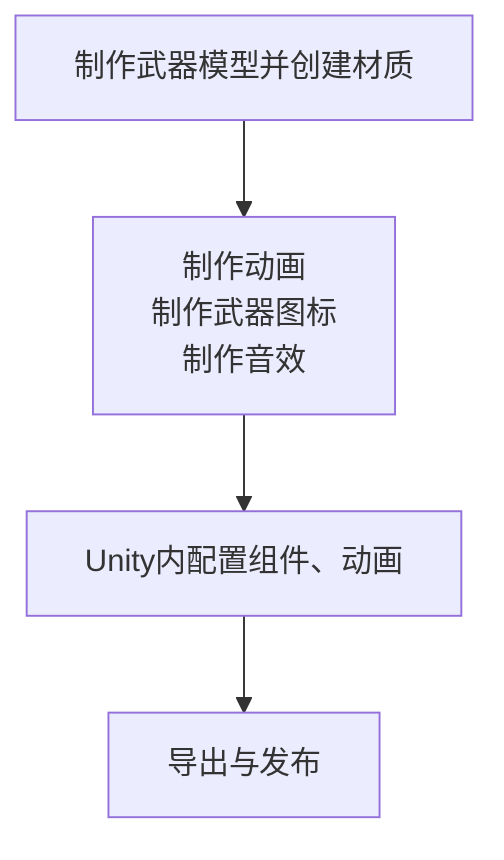

# wpn.1 武器
## 前言
在此文档中，我们将为您呈现制作一个武器的大致过程并详细解释每一步制作过程

:::info
**在本文档中，我们不会指导您制作套皮武器，在武器本身各方面高质量的情况下，这样固能快速生产大量高质量MOD，但在质量不可控的情况下这种做法却会让低质MOD污染Steam工坊环境，因此我们不提倡初阶MODDER模仿这些做法，套皮的流程敬请您在日后的实操中摸索。**
:::

**当前您所需掌握的技能点：**

简单建模

Blender基本操作

简单骨架变换

打关键帧

Unity游戏物体基本变换

Unity组件的应用

Animator组件

动画机的应用（States、BlendTree...）
## 0.0 构思
想什么？⊙﹏⊙∥

想你要做什么东西，

你要做的东西对应你所需要使用的Unity组件：
| 武器类型 | 对应组件 |
|------|------|
| 撬棍，刀等近战武器 | [MeleeWeapon](/cn/Components/MeleeWeapon.md)（如带修理功能则是[Wrench](/cn/Components/Wrench.md)） |
| 手榴弹、烟雾弹等投掷类武器 | [ThrowableWeapon](/cn/Components/ThrowableWeapon.md) |
| 火箭筒、枪械 | [Weapon](/cn/Components/Weapon.md) |

而上述的每一种武器都需要以下流程：


他有什么？想好了吗？

好！

那我们现在开始吧！ 

## 1.0 确定所需资源

一般来说，一个武器包含的美术资源有模型、音效、以及[粒子效果](https://docs.unity.cn/cn/2020.3/Manual/ParticleSystems.html)

音效对于冷兵器来说只有攻击音效、热兵器有攻击、切换、装填等音效，如果是单/多发装填武器则需要将装填音效分割成多个片段以对应各个装填动画，如果只是想练手可以选择直接套用RFTools自带音效用于测试

冷兵器不需要粒子效果，热兵器则需要枪口火花、烟雾等，可以选择直接套用RFTools自带的粒子

上述两项资源需要您自行上网寻找或按要仿制的游戏武器自行寻找对应原版游戏美术资源

模型将在[下一章](#_1-1-建模)详细解释

## 1.1 建模

按你所想的制作模型，是什么就什么，例如近战武器就制作本体，手榴弹就制作弹体

枪械需要制作枪体、弹体（不是一般意义,参考RFTools\Prefabs\Projectiles，可直接使用RFTools自带）、弹壳（建议使用RFTools自带RFTools\Models\Weapons\Misc\casing.blend）

不需要制作手臂模型，手臂模型RFTools自带，只需制作武器本体

如果只是想练手，可以直接使用RFTools\Models\Weapons内的模型

如果想自己制作而建模有些许不行，可以在Sketchfab这类网站寻找模型或按要仿制的游戏武器自行寻找对应原版游戏美术资源

当我们制作完模型后，它应该看着应该是这样的：

{缺图}

所有的物体能独立的都已独立并设置了父物体（以后你就懂力😋），原点正确，已应用缩放，物体mesh无问题

这时您就可以在菜单处追加RFTools\Models\Character\Hands.blend内的所有内容

并继续下一步

::: details 如果您的武器包含光学瞄具、全息瞄具...（瞄具预制作方法）
**双渲镜与UI材质方案**：请单独选择一个薄的物体（类似标准正方体、圆柱）放在瞄具对应的位置，并单独给予一个材质（不用纠结用什么，材质在Unity都会被替换），这个物体在Unity会被修改成瞄具瞄准画面，替换完成后，他看起来应该像这样

{缺图}

准星将在稍后再Unity配置，请预制做一个准星贴图

**贴图方案（仅光学）**：直接制作一个准星贴图放置在瞄具对应的位置即可（RFTools\Models\Weapons\Sinper.blend内有，可以在此基础上修改）

后续详细过程请参考[2.? ????](#2??)
:::

## 1.2 制作动画

当您追加RFTools\Models\Character\Hands.blend完成后，它应该看着是这样的：

{缺图}

相机的位置在X0 Y0 Z0，所有物体均已应用缩放

不用担心这个手怎么这么高而调整他的位置，始终保持在X0 Y0 Z0，他的位置稍后做动画时可以在姿态模式中调整

好，在Blender菜单栏将新建一个工作区，自行命名工作区，将工作区调整为如下样式

{缺图}

这需要您合并、分割区域，添加线性编辑器、动画摄影表、时间线，属性编辑器上方添加添加一个3D视图并调整为相机画面

相机画面需要隐藏标题栏、视图Gizom以移除遮挡画面的工具UI

动画摄影表需要取消勾选“仅显示已选中”以显示所有关键帧，这有助于确保物体关键帧与对应的姿态关键帧保持在同一个位置

这时，我们先打开姿态模式，调整好手的位置、形态：

{缺图}

按您的需求，在“骨骼约束”为骨骼设置子级将手部的两个主骨骼（这两个就够了！）绑定在武器对应的位置，譬如:

{缺图}

这时，我们就可以正式开始为武器制作动画

无论哪种武器，按照[Weapon](/cn/Components/Weapon.md)提供的Parameters，您都至少需要制作6个动画，分别为：切换、待机、瞄准(非热兵器可以不做)、装填、冲刺、踢(没错指挥队员、召集队员两个动画可以偷懒不做hhh)

每个动画的大概用时可以参考官方模型（RFTools\Models\Weapons\，片段划分需要在Unity的文件Inspector\Animation\Cilps一栏查看）

动画制作过程如下：
```
1. 
```

