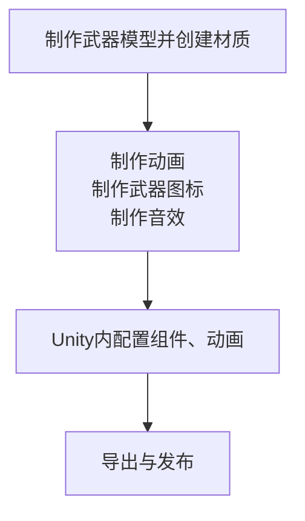
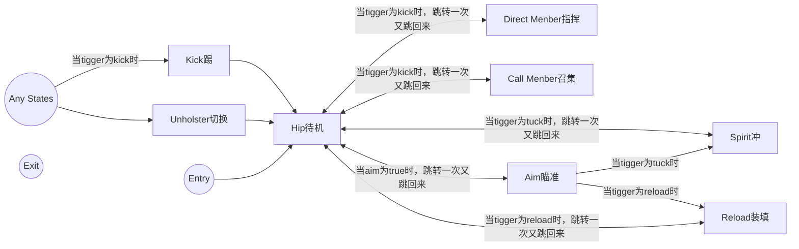

# 教程 wpn.1 武器
## 前言
在此文档中，我们将为您呈现制作一个武器（主要面向热兵器）的大致过程，使用原版武器作为示例

:::info
**在本文档中，我们不会指导您制作套皮武器，在武器本身各方面高质量的情况下，这样固能快速生产大量高质量MOD，但在质量不可控的情况下这种做法却会让低质MOD污染Steam工坊环境，因此我们不提倡初阶MODDER模仿这些做法，套皮的流程敬请您在日后的实操中摸索。**

**当然自己玩的不算 XD**

另外，制作高还原度与质量的枪械模组，同样需要你入门一些基础枪械知识，尝试过其他modder的枪械手感来模仿优化你的枪械参数

对于空仓、空挂、多瞄具动画适配、动画机layer叠加等高级特性，参见[百度贴吧精品贴](https://tieba.baidu.com/f?kw=ravenfield&ie=utf-8&tab=good&cid=4)或进[社区QQ群](./README.md#社区服务支持)请教武器modder
:::

## 0.0 构思
想什么？⊙﹏⊙∥

想你要做什么东西，

你要做的东西对应你所需要使用的Unity组件：
| 武器类型 | 对应组件 |
|------|------|
| 撬棍，刀等近战武器 | [MeleeWeapon](/cn/Components/MeleeWeapon.md)（如带修理功能则是[Wrench](/cn/Components/Wrench.md)） |
| 手榴弹、烟雾弹等投掷类武器 | [ThrowableWeapon](/cn/Components/ThrowableWeapon.md) |
| 火箭筒、枪械 | [Weapon](/cn/Components/Weapon.md) |

而上述的每一种武器都需要以下流程：


他有什么？想好了吗？

好！

那我们现在开始吧！ 

## 1.0 确定所需资源

一般来说，一个武器包含的美术资源有模型、音效、以及[粒子效果](https://docs.unity.cn/cn/2020.3/Manual/ParticleSystems.html)

音效对于冷兵器来说只有攻击音效、热兵器有攻击、切换、装填等音效，如果是单/多发装填武器则需要将装填音效分割成多个片段以对应各个装填动画，如果只是想练手可以选择直接套用RFTools自带音效用于测试，如果追求武器的精致则还需更多音效

冷兵器不需要粒子效果，热兵器则需要枪口火花、烟雾等，可以选择直接套用RFTools自带的粒子

上述两项资源需要您自行上网寻找或按要仿制的游戏武器自行寻找对应原版游戏美术资源（如解包、Unity AssetsStore的资源或手搓。音效可以从B站相关视频录音，常用）

模型将在[下一章](#_1-1-建模)详细解释

## 1.1 建模

按你所想的制作模型，是什么就什么，例如近战武器就制作本体，手榴弹就制作弹体

枪械需要制作枪体、弹体（不是一般意义,参考`RFTools\Prefabs\Projectiles`，可直接使用RFTools自带）、弹壳（建议使用RFTools自带`RFTools\Models\Weapons\Misc\casing.blend`）

不需要制作手臂模型，手臂模型RFTools自带，只需制作武器本体

如果只是想练手，可以直接使用`RFTools\Models\Weapons`内的模型

如果想自己制作而建模有些许不行，可以在[Sketchfab](https://www.sketchfab.com/)、[模之屋](https://www.aplaybox.com/)这类网站寻找模型或按要仿制的游戏武器自行寻找对应原版游戏美术资源（新手建议）

当我们制作完模型后，它应该看着应该是这样的：

{缺图}

所有的物体能独立的都已独立并设置了父物体（方便后期维护+Clone），原点正确，已应用缩放，物体mesh无问题

这时您就可以在菜单处追加`RFTools\Models\Character\Hands.blend`内的所有内容

并继续下一步

::: details 如果您的武器包含光学瞄具、全息瞄具...（瞄具预制作方法）
**双渲镜与UI材质方案**：请单独选择一个薄的物体（类似标准正方体、圆柱）放在瞄具对应的位置，并单独给予一个材质（不用纠结用什么，材质在Unity都会被替换），这个物体在Unity会被修改成瞄具瞄准画面，替换完成后，他看起来应该像这样

{缺图}

准星将在稍后再Unity配置，请预制做一个准星贴图

**贴图方案（仅光学）**：直接制作一个准星贴图放置在瞄具对应的位置即可（`RFTools\Models\Weapons\Sinper.blend`内有，可以在此基础上修改）

后续详细过程请参考[2.5 瞄具设置（仅枪械）](#_2-5-瞄具设置-仅枪械)
:::

## 1.2 制作动画

当您追加`RFTools\Models\Character\Hands.blend`完成后，它应该看着是这样的：

{缺图}

相机的位置在X0 Y0 Z0，所有物体均已应用缩放

不用担心这个手怎么这么高而调整他的位置，始终保持在X0 Y0 Z0，他的位置稍后做动画时可以在姿态模式中调整

好，在Blender菜单栏将新建一个工作区，自行命名工作区，将工作区调整为如下样式

{缺图}

这需要您合并、分割区域，添加线性编辑器、动画摄影表、时间线，属性编辑器上方添加添加一个3D视图并调整为相机画面

相机画面需要隐藏标题栏、视图Gizom以移除遮挡画面的工具UI

动画摄影表需要取消勾选“仅显示已选中”以显示所有关键帧，这有助于确保物体关键帧与对应的姿态关键帧保持在同一个位置

这时，我们先打开姿态模式，调整好手的位置、形态：

{缺图}

按您的需求，在“骨骼约束”为骨骼设置子级将手部的两个主骨骼（这两个就够了！）绑定在武器对应的位置，譬如:

{缺图}

这时，我们就可以正式开始为武器制作动画

无论哪种武器，按照[Weapon](/cn/Components/Weapon.md)提供的Parameters，您都至少需要制作6个动画，分别为：切换(Unholster或Entry)、待机(Idle)、瞄准(Aim。非热兵器可以不做)、装填（Reload）、冲刺(Spirit)、踢(Kick)(没错指挥队员Direct Member、召集队员Call Member两个动画可以选择偷懒不做hhh)

每个动画的大概用时可以参考官方模型（`RFTools\Models\Weapons`，片段划分需要在Unity的文件`Inspector\Animation\Cilps`一栏查看）

动画的细节很多，官方提供的模型动画示例都相对简单，你可以按想制作动画的精细程度，给一个动画是一个单帧动画还是一个循环多帧动画（如冲刺），或按Parameters制作更多动画（如开火、多瞄准、空挂，不了解请必应一下）

动画制作过程如下：
```
* 善用快捷键可以事半功倍 *
* 不用担心各动画的过渡，Unity会自动过渡 *
** 请始终确保践行一个原则：插入关键帧只插入有变动的物体与骨骼，一切从简，不要随手一个A（全选）加I（插入关键帧） **

1. 估计一个动画的大概用时并划分时间
2. 估计一个动作的大概用时并移动时间轴至对应时间点（tip：12帧=1秒，帧≠帧率FPS）
3. (物体模式下)变换物体位置并插入关键帧
4. (姿态模式下)变换骨骼位置并插入关键帧
5. 精修动画：细调物体、骨骼动画，细调动画曲线以修改过渡动作过渡
6. 重复以上过程
```
::: tip
投掷类武器在开火（投掷）动画这一个可能有点难，可以选择建一个空物体作为投掷点帮助K帧，然后再在Unity替换这个点
:::
这部分用时较长，开始的时候一个动画K几小时很正常，K得动作僵硬或不真实也十分正常，多模仿加练习就行

武器动画风格多样，COD风和轻柔风二选一，网上（比如Battlefield的武器演示或者RF的modder们在B站的武器演示与K帧实况）以及[Steam工坊](https://steamcommunity.com/workshop/browse/?appid=636480&requiredtags[]=Weapons)。优秀例子过多，恕不一一举例，请自行临摹（

另外，请确保手部骨骼始终保持贴合手的模型，像左图而不是右图，否则Unity内可能会出现动画问题：

{缺图}

K完帧了？是时候下一步了

::: tip
简单动画（如抛壳）可以在[Unity](https://docs.unity.cn/cn/2020.3/Manual/AnimationEditorGuide.html)中完成
:::

## 1.3 制作武器图标
此步将介绍工坊的武器图标常用制作方法（当然可以选择截屏，但此处我们随大统）

先新建一个blend工程（为不影响原工程）

然后追加武器模型，调整模型位置，添加相机（大小随意，默认相机大小即可）与光源（面光）:

{缺图}

将您的武器与相机对齐

转到属性，在世界属性中将背景颜色改为纯黑（表（曲）面-颜色，背景节点）

在渲染属性中勾选`Freestyle`，将线条宽度改为`2.5px`(默认分辨率下)

在视图层属性中勾选`Freestyle`，在其子选项卡“`Freestyle线条样式`”中选择颜色，将基础色改为纯白

最后渲染图像即可

太白灯光就后退一点，几乎没东西灯光就近一点：

{缺图}

最终效果参考`RFTools\Materials\Textures\UI\Weapons`

## 1.4 音效制作
这部分需要看自己

需要按你自己制作的动画去剪辑音效（一般网上找到的特别是从实录视频剪下来的可以直接用，但装填音效这个大坑要注意。单/多发装填武器则需要将装填音效分割成多个片段以对应各个装填动画）

注意让音效对应动画

如果只是想练手可以选择直接套用RFTools自带音效用于测试

## 2.0 导入Unity
是时候将模型导入进Unity了

导出的过程敬请参考首页的[提示](/cn/Tutorials/#模型、动画制作)

然后我们打开Unity项目

如果您未创建Unity项目或导入`RFTools.unitypackage`，请自行导入，此处不再赘述

## 2.1 配置动画Cilps

此处配置动画片段，这部分稍后会在动画机用到

在Unity的`Project`窗口选中模型文件，在右侧的`Inspector`选择`Animation`选项卡：

{缺图}

在Clips处新建动画片段并在`Start`与`End`处设置动画起始帧与结束帧（像`1~25`、`1~2`而不是`1~1`，`1~1`在Unity无法正常播放补救方法为`0.9~1`），设置好所有的片段（名字按动画随便起）：

{缺图}

请始终确保待机(Hip，此时武器枪口正对前方)动画处于`Cilps`的最顶层，这将有助于在Unity场景中设置枪口位置！

::: details 如果您的武器是单/多发装填武器...（配置动画事件）
此处配置动画事件用于单/多发装填武器能在对应的动画时间点播放正确的音效

首先确保你已经配置好动画Cilps，将Reload动画细分为开始装弹、装入子弹动作、结束装弹（拉栓）,将开火动画（仅包括跳栓）以及Idle动画细分.**参考**`RFTools\Models\Weapons\Garand.blend`：

{缺图}

这一步需要先行在场景配置[Weapon](/cn/Components/Weapon.md)组件（启用`advenceReload`）以及[SoundBank](/cn/Components/SoundBank.md)组件,若未配置请先调至[下一章](#_2-4-在场景配置武器)然后再配置动画事件

选中要播放自定义的Cilp，转到下方的`Events`选项卡，将时间轴拖至对应时间点后单击旁边的`Add Event`，参考[SoundBank的组件文档](/cn/Components/SoundBank.md)配置这个`Event`的`Function`为PlaySoundBank以及`Int`为对应的音效index

重复以上操作

**最后注意在结束装弹的对应时间点添加一个`Function`为`ReloadDone`的Event**

**在一个装弹循环结束的对应时间点添加一个`Function`为`MotionDone`的Event**

否则游戏时会卡动画
:::

::: details 如果您的武器是投掷类武器...（配置动画事件）
同上

**在投弹的的对应时间点添加一个`Function`为SpawnThrow的Event**
:::

## 2.2 预配置武器图标
此处配置武器图标的部分属性，否则在[下一章](#_2-4-在场景配置武器)时可能会出现奇怪的Bug（？

在Unity的`Project`窗口选中武器图标文件，在右侧的`Inspector`选择将图标的`Texture Type`改为`Sprite(2D and UI)`，勾选`Generate Mip Maps`，`Filter Mode`改为`Trilinear`：

{缺图}

这样就将武器图标从普通图片配置成了Sprite（又称精灵图或UI图像）

## 2.3 配置Projectile（仅热兵器）

为你的武器配置子弹

在本站的组件文档处找到一个合适的Projectile组件，在Unity添加在子弹（弹体）模型上

然后预制件化

或者可以选择直接套用RFTools自带的Projectile（建议复制一份保留原件）

记得添加自发光材质，具体参考`RFTools\Prefab\Projectiles`内的Projectile预制件

等会要用

::: details 如果您的武器是烟雾弹...（烟雾弹原理）
:::

## 2.4 在场景配置武器
打开`RFTools\Sence\Weapons Lab.unity`场景

然后将模型拖入左边的大纲视图（直接拖进场景难以调整位置），并确保场景内的其他武器处于禁用状态（在Inspector内消掉其他物体的复选框，不包括顶头的“`Camera Parent`”、“`Directional Light`”、“`Plane`”、“`Soldier Weapon Holder Preview`”、“`EventSystem`”、“`Target Cube`”）

这时他看着应该是这样的：

{缺图}

选中您的武器（它现在应该自带Animator组件）：

{缺图}

添加[Weapon](/cn/Components/Weapon.md)（或按武器类型添加[MeleeWeapon](/cn/Components/MeleeWeapon.md)、[Wrench](/cn/Components/Wrench.md)或[ThrowableWeapon](/cn/Components/ThrowableWeapon.md)）、Audio Source（Weapon组件会附带）组件

现在配置[Weapon](/cn/Components/Weapon.md)（或[MeleeWeapon](/cn/Components/MeleeWeapon.md)、[Wrench](/cn/Components/Wrench.md)或[ThrowableWeapon](/cn/Components/ThrowableWeapon.md),都是必填，**参阅[组件文档](/cn/Components/README.md)**，要优先配置派生组件的选项）组件：

创建一个（多枪口可以多个）名为`Muzzle`（作为枪口、近战武器攻击点或投掷类武器投掷点，其他名字亦可）的空物体对齐模型的枪口（或投掷点），确保空物体Z轴正对前方：

{缺图}

然后将这个空物体拖入Weapon组件(或其他)的`muzzles`：

{缺图}

在`Muzzle`物体下新建多个空物体作为枪口火花、烟雾的[粒子系统](https://docs.unity.cn/cn/2020.3/Manual/PartSysMainModule.html)（自行配置,主要为Particle System主模块（管理一般参数）与Renderer模块（管理外部模型、图像的渲染与显示）的参数，可以从其他武器复制、冷兵器可以跳过）

在抛壳口的位置新建一个名为`casingParticles`的空物体作为抛壳口的[粒子系统](https://docs.unity.cn/cn/2020.3/Manual/PartSysMainModule.html)（自行配置,Particle System主模块（管理一般参数）与Renderer模块（管理外部模型、图像的渲染与显示），可以从其他武器复制、冷兵器可以跳过）,将这个空物体拖入Weapon组件的`casingParticles`

在`projectilePrefab`处配置子弹的的Prefab（不是一般意义,参考`RFTools\Prefabs\Projectiles`，可直接RFTools复制一份使用，此物体必须包含[Projectile](/cn/Components/Projectile.md)或其派生组件，当子弹为重火力兵器时建议添加在子弹上添加`Audio Source`）

然后检查并配置组件的`displayName`、`thirdPersonTransform`、`reloadAudio`（仅热兵器）、`uiSprite`、`arms`、`ammo`（仅热兵器，否则设置为-1）、`auto`（仅热兵器）、`spareAmmo`（仅热兵器，否则设置为-1）、`resupplyNumber`（仅热兵器，否则设置为-1）、`reloadTime`、`aimFov`、`pose`、`advancedReload`、`effInfantry`、`effInfantryGroup`、`effUnarmored`、`effArmored`、`effAir`、`effAirFastMover`,其他选项的看需求配置（**参阅[组件文档](/cn/Components/README.md)**）

`kickback`、`randomKick`、`spread`、`followupSpreadGain`、`followupSpreadStayTime`、`followupSpreadDissipateTime`、`snapMagnitude`、`snapDuration`、`snapFrequency`等武器手感（仅热兵器，否则以上参数请清零）相关的参数需要慢慢调

## 2.5 瞄具设置（仅枪械）
瞄具有四种，分别为：机械瞄具、光学瞄具、全息瞄具、红点瞄具

### 机械瞄具

最简单的瞄具，在Blender K好瞄准动画，直接跳到[下一章](#_2-6-制作动画机)即可，可以调Weapon的`aimFov`

### 光学瞄具

光学瞄具有两种设置镜头的方法：

一是直接像官方的Sinper一样直接在Blender套一个**贴图物体**在镜筒，到Unity就直接套材质和改`aimFov`

二是**双渲染**：在Bledner放个薄的物体（类似标准平面、圆柱）当镜片，
在Unity新建一个`Render Texture`材质，`500x500px`大概够用了：

{缺图}

新建普通材质，将类型改为`Unlit\Texture`，`Base`选择刚才创建的`Render Texture`：

{缺图}

场景内新建一个摄像机在武器下（不要放在武器模型的层级下）,检查器内的`Target Texture`就选刚才创建的`Render Texture`：

{缺图}

最后，把刚才创建的普通材质应用在镜片即可，相机的Z轴位置可以调一下，跟换倍率的效果差不多：

{缺图}

::: details 狙击手聚焦视角
{缺图}

对于像图中的狙击手聚焦视角，把场景内的`FP_scope`（官方武器Sinper下）复制到与镜片相同的层级下即可，可能需要细调一下`FP_scope`的位置，请自行调整，别忘记把这个物体拖到Weapon组件的`scopeAimObject`里！

如果不满意`FP_scope`的标线，您可以到Blender自行更改，它在`RFTools\Assets\Models\Weapons\Sinper.blend`里 
:::

### 全息瞄具
同光学瞄具，在Bledner放个薄的物体（类似标准平面、圆柱）当镜片，在Unity再复制一份到同样的位置

分别给予`RFTools\Materials\UI\HUD Glass.mat`（作镜片）与`RFTools\Materials\Weapons\Holo Sight.mat`（做红点贴图）材质

红点贴图可以在`Holo Sight`的材质选项改

镜片颜色可以在`HUD Glass`的材质选项中的`Tint Color`改

贴图太大可以把带`Holo Sight`材质的物体的Y方向拖远一点

### 红点瞄具
同样简单，在武器下新建一个空物体，添加组件`Line Render`，取消勾选组件的`Use World Space`

将`Positions`的`Sizes`设为2，`Element 0`不动，调整`Element 1`的Z方向长度即可，颜色可以在`Color`改，`Width`可以改线条宽度，`Material`处可以改射线材质（`RFTools\Materials\Tracers`）：

{缺图}

## 2.6 制作动画机
这玩意就需要你的想象力了

`Project`窗口右键新建一个动画机`AnimationController`，双击打开

动画机本质上就是各种状态时的if、if、if...，通过这些if与Parameters的配合，帮助模型跳转至一个合适的动画，但是各个States的链接有点费脑，一个基础的动画机（.controller）实例如下：

这是官方AK 47的动画机

如果武器复杂，动画机就会更复杂，这就需要你依靠parameters发挥充分的逻辑想象力（不要感到害怕，实际上如果动画确实复杂，动画机布线确实会像蜘蛛网一样密集XD，能用就行）

善于运用[动画机过渡](https://docs.unity.cn/cn/2020.3/Manual/StateMachineTransitions.html)、[动画层](https://docs.unity.cn/cn/2020.3/Manual/AnimationLayers.html)、[States](https://docs.unity.cn/cn/2020.3/Manual/class-State.html)的各个知识点（例如一个动画的过渡、过渡时间、循环等。虽然大部分情况用不到？）

特别是单/多发装填武器，在配置动画事件后，这应该会简单一点点，参考官方`RFTools\Animations\Weapons\Garand.controller`

## 3.1 参数细调

同上，细调关于武器射击、子弹伤害的参数

用以确保游戏平衡，导致一些诸如一枪秒、刮痧等事故而影响体验

这是一个繁琐的过程，在Unity Editor基本调完后还要在游戏里测试

各种武器的属性参见互联网与B站，如OfficialArch系列

## 3.2 武器特性索引

这里用于索引官方武器中的实现的一些特殊功能

### 3.2.1 MK25开火动画

在Blender做好套筒移动的动画（只包括套筒移动的关键帧），在Unity配置好Animation Clip

然后打开你的动画机文件，新建一个Layer（左上角那里），Layer属性保持默认，但Weight一项应注意与你的第一个Layer（即`Base Layer`）的值保持一致

以`Any State`为起始，像平常一样把套筒移动的动画Clip拖进去，以trigger`fire`为条件即可

其他的ccoltroller也一样，注意它们的layer！

### 3.2.2 N发装填武器

参上

### 3.2.1 

## 3.3 测试与导出
现在我们的武器基本完工了！

此时你的武器物体结构应该是这样的（模型等部分位置可变）：
```
武器顶层父物体（包含武器、Animator组件）
├─ 手臂模型
├─ 武器模型（包括muzzle、casing及粒子系统物体）
└─ 其他的一些Audio Source物体或与SoundBank物体
```

这时您就可以在Weapon Lab场景中通过 Play播放 预览来武器了

附场景内的的可用键位：
| 键位 | 功能 |
|------|------|
| `鼠标左键` | 开火 |
| `鼠标右键` | 瞄准 |
| `R` | 装填 |
| `X` | 切换开火模式 |
| `T`+`鼠标滚轮上` 或 `4` | 下一个瞄准模式 |
| `T`+`鼠标滚轮下` 或 `3` | 上一个瞄准模式 |
| `数字键盘1` | Unholster |
| `CapsLock` | 子弹时间 |
| `+` | 增加标靶的距离50m |
| `-` | 减少标靶的距离50m |
| `T` | 标靶视图 |

如果不能正常播放请检查组件设置与场景内是否有其他武器处于启用状态

部分功能需要在游戏内测试（例如踢的动画，转动视角...）,但这需要导出Mod

所以我们需要先配置`WeaponCotentMod`（武器导出向导）组件

配置过程参考[WeaponContectMod的组件文档](/cn/Components/WeaponCotentMod.md)

然后选中你的武器Prefab，在[菜单栏](./otr.1.md)上的 Ravenfied Tools 里 选择  “Test ...”或“Export ...”，然后即可测试或导出
